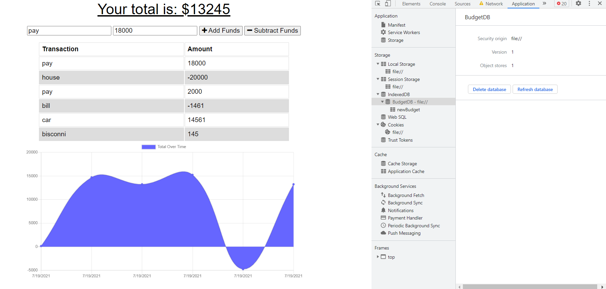

# Progressive_Budget

## Description
This budget tracker app allows the user to add and subtract funds from their tracker with or without a connection. Entering transactions offline, user's data will populate the total when brought back online.This application uses IndexDB, Service Workers and Web Manifest to enable offline functionality.

The user will be able to add expenses and deposits to their budget with or without a connection. 

## Usage
This application will allow users to create new transactions whether it's a deposit or withdraw, with or without internet connection.

Deployed Link: https://budget1994.herokuapp.com/

## Install 
Dependencies neede for this project:

- express
- mongoose
- morgan
- compression

use command: npm install & use command: npm start

## Support

If you have any questions, or open issues about the repo, I can be reached at: 

Email: ahsan.ali0307@gmail.com 

GitHub: @ahsan13101994.